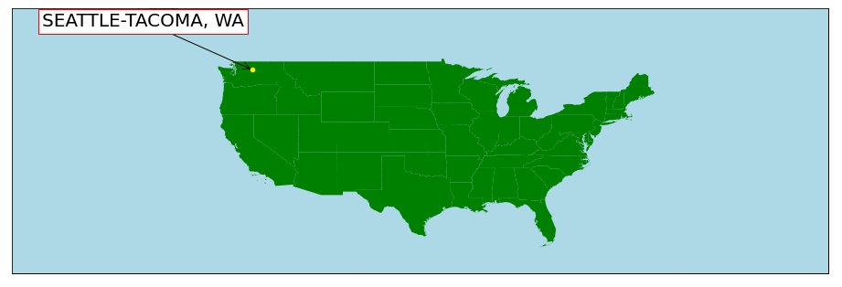

### tour_route_planner
# On The Road Again: <i> Using Deep Learning + Regional Analysis to Remap the American Tour Route</i>
 
Hello there, and thank you for visiting my project repo! This project is the culmination of my data science training at <a href='www.thisismetis.com'>Metis</a> 
Data Science Bootcamp, and utilizes skills in neural networks and deep learning using Keras and TensorFlow, NLP tools for sentiment analysis, and data visualization
utilizing Tableau and seaborn. 

  

<h3>Project Primer</h3>
National tours have been a staple of the entertainment industry since the vaudevillian tours of the 1920's. They allow individuals all over the country, with 
various connections to resources and opportunity, the chance to see some of the finest live shows in the world. I was fortunate enough to contribute to one of these
productions as the Associate Conductor of the <i>Jersey Boys</i> national tour. I saw how seemingly nonsensical these tour routes can look, but noticed that there 
was a rhythm and a cadence. Many factors go into a route, chiefly the availability of venues. However, it seemed there could be an easier way for producers and
managers to automate the "mapping" process in order to focus on targeting areas of opportunity.

  

This project provides both tools to auto-generate maps and target areas of opportunity. The map is generated through an LSTM recurrent neural network, which
is particularly well-poised to investigate a sequence, and the understanding of a data point's place in that sequence - not unlike a national tour route! There
is also a tool to track COVID-19 sentiment in the area, scraped from Twitter - with human intuition, a more positive average polarity could indicate the willingness
of a market to gather safely. Finally, there is a tool to track search term engagement for "Theatre Near Me", a popular search term for anyone interested in
theatrical opportunities near them. 

  

<h3>LSTM Neural Network</h3>
There are actually two neural networks at play here - one uses the previous coordinates to predict <b>latitude</b>, and the other to predict <b>longitude</b>. 
Both RNN's have a simple tanh starting LSTM layer. The latitude model then has just one hidden layer, with four neurons. The longitude layer, given the comparitive
breadth of the United States, utilizes more layers in the neural network - one dropout layer, a hidden layer of two neurons, followed by a hidden layer of five 
neurons. These parameters were fine-tuned over several iterations to find the maximum learning potential. The networks were trained on a test route (the first
national tour of <i>Wicked</i> and then further training was from 100+ other tour routes since 2003. Below is a visualization of the auto-generated tour route:

 

The project was originally focused on search term engagement with different titles in various markets. A RandomForest regressor model was developed, but ultimately
determined to be impractical for the intentions of this project. 
